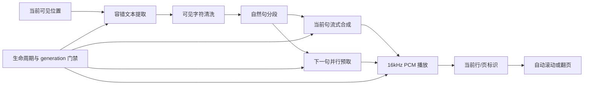
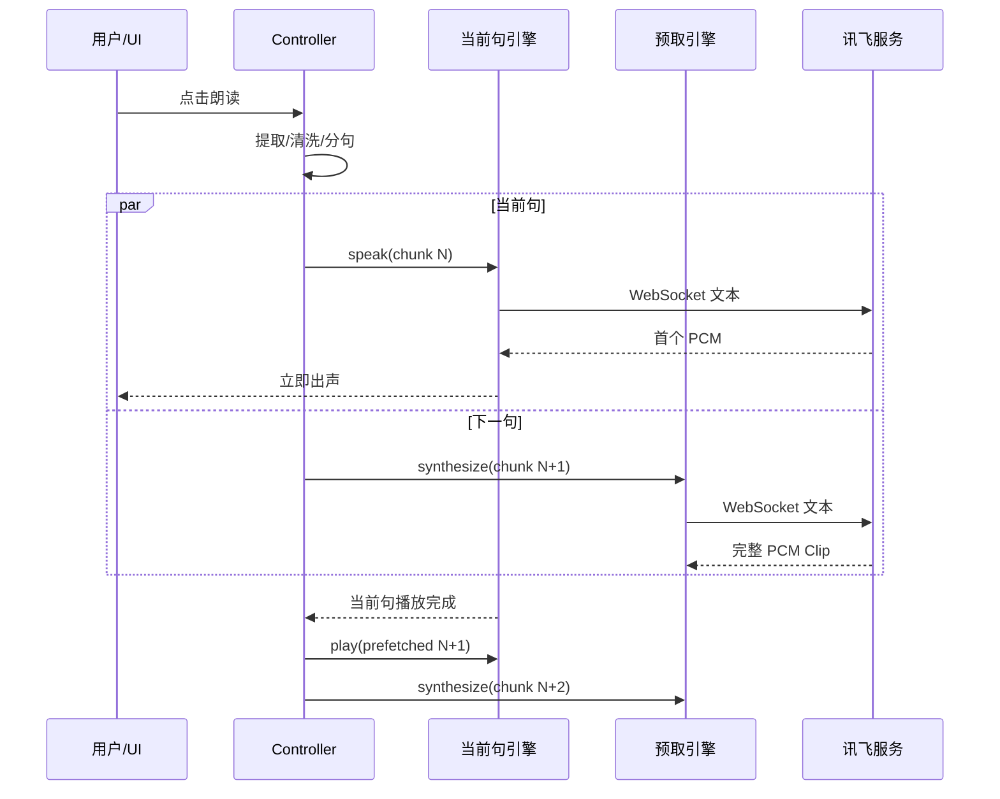

# Android 文档朗读（TTS）从需求到真机闭环的完整实现指南

> 适用对象：需要在 Android 文档、电子书、PDF、Office 或双屏阅读产品中加入云端 TTS 的项目。
>
> 来源项目：双屏OFFICE（KEMI OFFICE）
>
> 最终基线：`v1.0.81 / versionCode 10081`
>
> 功能源码提交：`f83a24204d631aa913a41bb1dd27f3854c31f9d4`
>
> 正式发布提交：`822355a2d2925b7dac9b52865ba9e67dc9070a0b`
>
> 整理日期：2026-08-15

本文不是接口摘录或结果摘要，而是记录一次文档 TTS 功能从初版、真机失败、根因定位、交互
重做，到最终能够连续朗读、从当前屏起播、标识当前行并自动跟随的完整过程。重点保留失败
方案和验收门禁，供其他项目直接复用。

---

## 1. 最终结果与产品规则

最终产品行为如下：

1. 文档内容未解析完成前不显示“朗读”，避免出现点了却不可用的假入口。
2. 点击“朗读”后从当前屏幕可见页或可见行开始，已经滑过的内容不再重复。
3. 第一段尽量短且保持自然语义，目标是在约 500ms 内开始出声。
4. 播放当前句时并行合成下一句；后续按完整句子申请，不为追求并发随意截断语句。
5. 读到哪一行，哪一行显示浅蓝背景和左侧品牌蓝竖线；画布类文档使用原生选区定位。
6. 语音进入下一屏后，正文自动滚动或翻页，让正在播报的内容始终可见。
7. 播放、暂停、恢复、关闭、HOME、返回和双屏窗口退出都必须形成确定状态，不能残留声音。
8. 云端不可用时可以回退 Android 系统 TTS；文档损坏、无文字、网络异常均受控提示，不能崩溃。
9. TTS 读取的是用户实际看到的正文，不直接朗读 OOXML/XML 标签、隐藏对象或格式控制字符。
10. 只使用系统已经下发的讯飞参数，应用源码、日志和文档均不得出现真实密钥。

真机最终数据：

- 小型文本类文档首个 PCM 为 `298–398ms`；Word 当前页起播复测为 `424ms`。
- YAML 全文 `19/19`、新智联 PPT 全文 `339/339`，均出现 `TTS_COMPLETE`。
- DIFF、SVG、LOG、INI、TOML、TEX、RTF 共 7 份小文档完整播完，首音 `318–398ms`。
- Word 从第 2 页起播时视口比例为 `0.33333334`，待播段数由从头读取的 80 段降为 47 段。

---

## 2. 需求演进：为什么初版不能直接交付

本功能不是一次设计完成，真实验收按以下顺序暴露问题：

| 阶段 | 表面问题 | 真正需求变化 |
|---|---|---|
| 入口初版 | 朗读区域太大、遮挡正文，与只读/设置风格冲突 | 入口必须与现有工具栏同层级、同图标语言，播放态必须极简 |
| 内容初版 | PPT 读出 XML、格式符和看不见的控制字符 | 音源必须来自“呈现内容”的语义文本，而不是原始文件字节 |
| 播放初版 | 第一句后等待，YAML/PPT 读一半停止 | 合成完成不等于播放完成；必须正确定义 PCM 播放结束条件 |
| 暂停初版 | 暂停后按钮能恢复，但没有声音 | 目标固件的 `AudioTrack.pause()/play()` 返回成功也可能静音 |
| 断句初版 | 固定字数截断，语气破碎 | 后续必须按句末标点，第一段才允许按自然小分句缩短 |
| 生命周期初版 | HOME 或退出后后台仍可能继续播放 | Activity、双屏窗口和异步回调都必须参与统一停止门禁 |
| 位置初版 | 每次都从文件开头朗读 | 当前可见位置才是唯一用户意图，过去内容必须忽略 |
| 跟随初版 | 声音继续但页面停在原处 | 当前句必须有视觉标识，并随语音自动滚动/翻页 |
| Word 特例 | 已滑到第 2 页，计算结果仍为 0 | Writer 原生分页层与 WebView 视口不是同一套滚动状态 |

经验：TTS 的完成标准不是“能发声”，而是内容正确、首声快、句间连续、状态可控、位置一致、
退出无残留，并且用户能看见声音正在对应哪一行。

---

## 3. 第一性原理与总体架构

把文档朗读拆成七个相互独立的责任层：



各层边界：

- 查看器负责回答“用户现在看到哪里”和“如何把某一行/页滚回可见区域”。
- `DocumentTextExtractor` 只负责把不同格式转为受限、可朗读的纯文本。
- `SpeechTextSegmenter` 只负责自然分句，不涉及网络和 UI。
- `IflytekTtsEngine` 只负责鉴权、WebSocket、PCM 缓冲和播放。
- `DocumentReadAloudController` 是状态机，协调 UI、提取、播放、预取、回退和生命周期。
- `PlaybackObserver` 把播放段落反向通知具体查看器，完成行级标识和自动跟随。

这种拆分让其他项目可以替换文档引擎、TTS 厂商或 UI，而不需要重写整条链路。

---

## 4. 讯飞接入与凭据安全

### 4.1 参数来源

系统预先把讯飞参数写入：

```text
Settings.Global["iflytek_params"]
```

应用读取 `token`、`app_id`、`api_key`、`wifi_mac`、可选的 `auth_id`、`sn` 和
`system_version`。若没有 `auth_id`，使用去掉冒号后的 Wi-Fi MAC 计算 MD5；若没有 SN，使用
`QUALMETA-{MAC大写}`。应用不申请、不硬编码、不落盘复制真实密钥。

### 4.2 网络顺序

1. 向业务鉴权接口提交设备 MAC、license、SN、系统版本和时间戳。
2. 只有 `code == "00000"` 且 `data.status == 0` 才继续。
3. 构造 AIUI TTS 参数：`data_type=text`、`vcn=x2_xiaojuan`、`scene=IFLYTEK.tts`、
   `tts_aue=raw`。
4. `param` 做 Base64 NO_WRAP；`checksum = SHA256(api_key + curtime + param)`。
5. WebSocket 收到 `started` 后发送当前句，再发送 `--end--`。
6. `result.data.content` 做 Base64 解码并写入 16kHz、16bit、单声道 PCM 播放器。

鉴权成功缓存 5 分钟，避免每一句都重新走 HTTP 鉴权；WebSocket 仍按句建立，便于取消与隔离
错误。网络超时分别设置连接 12 秒、读写 20 秒。

### 4.3 安全门禁

- 日志只写“使用系统参数”“鉴权成功”和错误类别，绝不打印 token、app_id、api_key 或完整 URL。
- 文本发送属于数据外发，自动真机测试前必须得到数据外发授权。
- 停止时关闭 WebSocket、释放 AudioTrack，并递增 generation；旧网络回调必须静默丢弃。
- 云端失败时只回退系统 TTS，不把错误文本交给其他未授权服务。

---

## 5. 文本提取：读取呈现语义，不读文件噪声

### 5.1 总体限制与容错

提取线程池固定 2 个线程，源文件最多读取 24MiB 可读部件，输出最多 2,000,000 字符。所有
输入流使用 try-with-resources；加密、损坏或无正文时回调受控错误，不让解析异常进入 UI 线程。

| 格式 | 提取方式 | 当前位置策略 |
|---|---|---|
| TXT/LOG/INI/YAML/TOML/TEX/DIFF/RTF/Markdown | 查看器已经解码的行模型 | `RecyclerView` 第一可见行 |
| JSON/XML | 格式化后的源行索引 | 可见 adapter 行映射回 source line |
| CSV/XLSX 快速查看 | 当前记录索引 | 第一可见数据行，跳过表头 |
| PDF | PDFBox `PDFTextStripper` | 精确设置 `startPage=currentPage+1` |
| PPT/PPTX | 只读取每张 slide 的 DrawingML `<a:t>` 文本运行 | 当前显示页映射到源 slide，继续到末页 |
| DOCX/ODT/XLSX/ODS | ZIP 内限定的正文 XML 部件 | 按当前页面比例裁剪文本起点 |
| HTML/EPUB/SVG | HTML 可见文本 | 章节/分页索引和页内滚动比例合成全局比例 |

PPT 初版直接读取通用 XML 文本，结果把布局、关系和用户看不到的内容送入 TTS。最终实现只在
DrawingML 的 `t` 文本节点内收集字符，并在段落结束处添加换行；隐藏 XML、格式属性和控制字符
不会进入音频。

### 5.2 最终清洗

在任何文本提交给语音服务之前统一执行：

- Unicode NFKC 规范化；
- CR 转换为 LF；
- 删除 C0 控制字符、方向控制符、零宽字符、BOM、私用区和未分配字符；
- 删除只有项目符号/标点的空行；
- 合并水平空白及三行以上连续空行；
- 保留真正的汉字、英文、数字、有效标点和换行。

这个门禁必须位于共享控制器，而不能只依赖各格式解析器，否则新增格式时很容易再次把控制符
送到云端。

---

## 6. 断句：首句快，后续完整

### 6.1 被否定的方案

初版首段固定 40 字、后续固定 56 字。它虽然让请求短，却会在词、数字或语句中间切断，语气
机械。另一轮把逗号、冒号、顿号都作为普通边界，在一个长测试文本中产生了 139197 个过碎
请求，网络、队列和日志完全失去控制。

### 6.2 最终算法

- 普通分段只识别中英文句号、问号、感叹号、分号、换行和省略号。
- 连续标点和紧随其后的闭合引号归入前一句。
- 小数 `3.14` 不在点号处分割；数字分组不因逗号破坏。
- 第一请求如果超过 64 字，可以在 12–64 字之间优先找逗号、冒号、顿号等自然小分句；
  找不到再找空格，最后才做 64 字兜底。
- 普通无标点文本保持完整；只有单段超过 800 字时才触发传输保护，优先从空格处分割。

核心原则：第一句负责感知速度，后续句负责语义连贯；不能让所有句子都为“首声优化”买单。

---

## 7. 低延迟流水线与下一句预取

使用两个独立 `IflytekTtsEngine`：

- `iflytek`：当前句流式接收并立即播放；
- `prefetcher`：当前句刚提交时就并行完整合成下一句，缓存为 `PcmClip`。



预取不是无限并发：任何时刻最多一个当前句和一个下一句。这样既消除句间等待，也避免长文档
一次性生成大量音频占用内存和云端配额。

---

## 8. 最关键的真机故障：第二句卡住 30 秒

### 8.1 现象

YAML 只读一句；PPT 播到一半停止；日志显示下一句已经合成，但每隔一段会等待旧的 30 秒超时。
没有 Java 崩溃，也不是网络断开。

### 8.2 根因

目标双屏固件的流式 `AudioTrack` 在短音频 underrun 后会把 `playbackHeadPosition` 清零或冻结。
旧代码把“播放头达到写入 sample 数”作为唯一完成条件，于是音频实际已经播完，状态机却永远
收不到完成，直到超时。

### 8.3 修复

PCM 格式固定为 16kHz、单声道、16bit，因此提交的 sample 数可以准确换算音频时长：

```text
durationMs = ceil(samplesWritten × 1000 / 16000)
deadline = playbackStartedAt + durationMs + 180ms
```

等待到该时间后释放 AudioTrack 并推进下一句，不再依赖固件不稳定的播放头。修复后 YAML
`19/19`、PPT `339/339` 全部完成。

可复用结论：硬件播放游标是观测值，不一定是可靠业务时钟；当 PCM 参数固定时，已提交的
sample 数才是跨固件更稳定的权威时长。

---

## 9. 暂停、恢复、退出与异步门禁

### 9.1 状态

控制器至少维护：`loading`、`speaking`、`paused`、`usingIflytek`、`chunkIndex`、
`prefetchIndex`、`prefetching`、`waitingForPrefetch`、`playbackGeneration`。

### 9.2 暂停后无声的根因与处理

目标固件上 `AudioTrack.pause()` 后调用 `play()`，API 可能返回播放状态，但扬声器仍然静音。
最终策略不是信任这个表面状态，而是：暂停时停止当前流但保留 `chunkIndex`；恢复时从当前句
重新建立流式播放。这样可能重复当前句的一小段，但不会出现“按钮显示播放、实际没有声音”。

### 9.3 generation 门禁

每次开始提取捕获当前 `playbackGeneration`。停止、HOME、退出时 generation 自增。任何晚到的
文本、鉴权、WebSocket、预取回调都先检查 generation，不一致就丢弃，防止用户关闭后音频复活。

### 9.4 生命周期

- `onStop()`：停止系统 TTS、两个讯飞引擎、PCM、动画和当前行标识。
- `onDestroy()`：额外 shutdown 系统 TTS，移除实例和生命周期观察者。
- 进程内只允许一个 active controller，新文档开始朗读时先停止旧文档。
- 双屏副窗口失焦时由 `OfficeDisplayCoordinator` 调用 `stopActive()`。
- D2 返回键进入 D0 权威 Activity 的关闭路径，保证两个物理屏一起退出。

已验证全局 HOME 会产生 `TTS_STOP reason=activity-stopped`。仅向 D2 窗口定向注入 HOME 时，
固件可能让 D0 Activity 继续 resumed，因此该特殊注入仍属于固件边界，不能误报完全闭环。

---

## 10. 从当前屏起播与自动跟随

### 10.1 各查看器的当前位置

| 查看器 | 起点 | 跟随方式 |
|---|---|---|
| 文本/配置/Markdown | 第一可见行 | 当前句匹配源行，滚到屏幕约 1/3 处 |
| JSON/XML | 可见 adapter 行映射的 source line | 更新 source-line 高亮并展开/滚动到可见行 |
| CSV/XLSX | 第一可见记录 | 合并单元格文本匹配记录，滚动表格行 |
| PDF | `currentPage` | 按朗读进度平滑滚到后续页面 |
| HTML/EPUB/SVG | 页/章索引 + 页内 scroll fraction | 从全局比例裁剪文本 |
| PPT | 当前显示页对应 source slide | 同步主页面、缩略图和页码 |
| Word/Calc | 画布可见矩形比例 | Core SearchService 搜索当前句并滚入选区 |

### 10.2 Word 的特殊突破

Writer 最终页面绘制在 `#koffice-writer-native-scroll` 原生分页层中。用户滚动该层后，WebView
的 `viewedRectangle` 仍可能为 0，导致第 2 页点击朗读却从第一页开始。

修复后遍历原生层可见子页，从 `dataset.page` 取页号，再除以 Core `_pages` 得到全局比例；
原生层不存在时才回退 `viewedRectangle/viewSize`。62 真机第 2 页得到：

```text
TTS_CURRENT_VIEWPORT fraction=0.33333334
TTS_SEGMENTS policy=punctuation count=47 firstChars=29 maxChars=61
First PCM queued in 424 ms
```

从头播放为 80 段，当前页起播为 47 段，证明不是只改变 UI 页码，而是真的裁掉了已滑过内容。

---

## 11. UI 演进与最终呈现规范

### 11.1 被否定的 UI

- 大面积朗读面板：遮挡正文，业务权重高于只读和设置，不符合现有界面。
- 朗读按钮单独加背景：与只读/设置不协调，点击状态也不统一。
- 播放、暂停、退出横向占据大块空间：影响阅读视野。
- 快速旋转动画：虽然表示“工作中”，但制造焦虑感；用户明确感知为太快。
- 文档未就绪就显示入口：点击无内容或白屏，让用户误以为 TTS 故障。

### 11.2 最终入口与播放态

- 文档内容发布后才调用 `markDocumentReady()` 显示入口。
- “只读、朗读、设置”保持同一工具栏高度、字体、图标和背景体系。
- 播放态为右上角 `48dp × 64dp` 蓝色圆角卡片，位于设置下方，距顶部 45dp、右侧 7dp。
- 顶部状态圆盘 36dp，中心为白色扬声器图标；底部分别为暂停/播放和关闭图标。
- 圆环使用线性动画，完整旋转一圈为 10 秒，不用高频动画假装速度。
- 当前句提示为 `360dp × 36dp` 单行圆角条，文字“● 正在朗读 · 当前句”，超长省略。
- 暂停时隐藏转圈并显示播放图标；恢复后重新显示转圈；停止后卡片和当前句提示一起消失。

### 11.3 当前行标识

文本、结构化文档和表格使用：

```text
整行底色：#EAF2FF
左侧竖条：4dp，#1F69E0
```

只刷新旧行和新行两个 adapter item，避免每句话触发全列表重绘。若当前行离开可见区域，滚到
屏幕约 1/3 处，为后续内容预留阅读空间。

画布类 Word/PPT/PDF 无法安全覆盖每一行的 RecyclerView 背景，因此使用 Core 原生选区或页面
定位，同时保留单行“正在朗读”提示。不要强行在画布上估算文字矩形，否则缩放、分页和双屏
坐标变换后很容易错位。

### 11.4 真机效果


图中当前 LOG 行使用浅蓝整行底色和左侧蓝条；右上角蓝色卡片提供暂停/关闭，旁边单行提示
显示当前句。该样式不改变正文颜色，不遮住主要阅读区域。

---

## 12. 源码与 GitHub 对照表

KEMI OFFICE 顶层仓库采用“固定上游 Git + 顺序补丁”管理产品修改。GitHub 中可重放的权威源码
位于补丁文件，运行 `scripts/verify-source.sh` 后生成下列 `upstream/android/...` 工作树文件。

权威补丁：

- GitHub：<https://github.com/caucy2026/kemi-office/blob/v1.0.81/patches/0164-android-document-operations-and-ppt-resilience.patch>
- 仓库路径：`patches/0164-android-document-operations-and-ppt-resilience.patch`
- 源码重放验证：`scripts/verify-source.sh`

| 职责 | 重放后的逻辑源码路径 | 在补丁中搜索 |
|---|---|---|
| 朗读状态机与 UI | `upstream/android/lib/src/main/java/org/libreoffice/androidlib/DocumentReadAloudController.java` | `DocumentReadAloudController` |
| 讯飞鉴权、WebSocket、PCM | `upstream/android/lib/src/main/java/org/libreoffice/androidlib/IflytekTtsEngine.java` | `IflytekTtsEngine` |
| 多格式容错文本提取 | `upstream/android/lib/src/main/java/org/libreoffice/androidlib/DocumentTextExtractor.java` | `DocumentTextExtractor` |
| 自然标点断句 | `upstream/android/lib/src/main/java/org/libreoffice/androidlib/SpeechTextSegmenter.java` | `SpeechTextSegmenter` |
| Word/PPT/Calc 当前位置与跟随 | `upstream/android/lib/src/main/java/org/libreoffice/androidlib/LOActivity.java` | `requestVisibleReadAloudText`、`followReadAloudPosition` |
| 双屏失焦停止 | `upstream/android/lib/src/main/java/org/libreoffice/androidlib/OfficeDisplayCoordinator.java` | `stopActive` |
| 文本/Markdown 接入 | `upstream/android/app/src/main/java/org/libreoffice/androidapp/ui/TextDocumentActivity.java` | `markReadAloudLine` |
| 文本行高亮 | `upstream/android/app/src/main/java/org/libreoffice/androidapp/ui/TextLineAdapter.java` | `setReadingLine` |
| JSON/XML 接入 | `upstream/android/app/src/main/java/org/libreoffice/androidapp/ui/StructuredDocumentActivity.java` | `requestVisibleReadAloudText` |
| JSON/XML 高亮 | `upstream/android/app/src/main/java/org/libreoffice/androidapp/ui/StructuredLineAdapter.java` | `setReadingLine` |
| CSV/XLSX 接入 | `upstream/android/app/src/main/java/org/libreoffice/androidapp/ui/CsvDocumentActivity.java` | `markReadAloudRow` |
| CSV/XLSX 行高亮 | `upstream/android/app/src/main/java/org/libreoffice/androidapp/ui/CsvRowAdapter.java` | `setReadingRow` |
| PDF 当前页与翻页 | `upstream/android/app/src/main/java/org/libreoffice/androidapp/ui/PdfViewerActivity.java` | `TTS_CURRENT_PAGE` |
| HTML/EPUB/SVG 当前位置 | `upstream/android/app/src/main/java/org/libreoffice/androidapp/ui/WebDocumentActivity.java` | `TTS_CURRENT_VIEWPORT` |
| 当前行背景资源 | `upstream/android/app/src/main/res/drawable/tts_reading_line_background.xml` | `#EAF2FF` |

配套 GitHub 文件：

- 自动真机脚本：<https://github.com/caucy2026/kemi-office/blob/v1.0.81/scripts/verify-tts-small-docs-device.sh>
- TTS/PDF/PPT 闭环原始报告：<https://github.com/caucy2026/kemi-office/blob/v1.0.81/docs/performance/KOFFICE_20260814_TTS_PDF_PPT_CLOSED_LOOP_REPORT.md>
- 全格式验收：<https://github.com/caucy2026/kemi-office/blob/v1.0.81/docs/performance/TEST_DOCS_ALL_FORMAT_ACCEPTANCE_20260815.md>
- 小文档测试结果：<https://github.com/caucy2026/kemi-office/blob/v1.0.81/docs/performance/tts-small-docs-192.168.3.62.tsv>

---

## 13. 调试日志设计

不要依赖“耳朵听起来好像完成”。每个阶段必须有稳定日志标记：

```text
TTS_CURRENT_VIEWPORT fraction=...
TTS_CURRENT_PAGE page=...
TTS_CURRENT_SLIDE slide=...
TTS_SEGMENTS policy=punctuation count=... firstChars=... maxChars=...
TTS_CHUNK_START index=N/T chars=...
TTS_PREFETCH_SUBMITTED index=...
TTS_PREFETCH_READY index=...
TTS_PREFETCH_PLAY index=N/T
First PCM queued in ... ms
PCM playback complete samples=... durationMs=...
TTS_CHUNK_DONE index=N/T
TTS_COMPLETE chunks=T
TTS_STOP reason=...
```

关键判定：

- 有 `TTS_SEGMENTS` 但没有 `First PCM`：鉴权/WebSocket/音频首包问题。
- 有 `PREFETCH_READY` 但下一段迟迟不开始：播放完成判定或状态机问题。
- `CHUNK_DONE` 不连续：暂停、generation 或回调丢失问题。
- 有 `TTS_COMPLETE` 才能声明全文播完；只听到声音不能算通过。
- HOME 后必须出现 `TTS_STOP`，且之后不能再出现同 generation 的 `CHUNK_START`。

推荐过滤命令：

```bash
adb -s 192.168.3.62:5555 logcat -c
adb -s 192.168.3.62:5555 logcat -v brief | \
  rg 'TTS_|First PCM|PCM playback|FATAL EXCEPTION|ANR'
```

---

## 14. 自动化与真机验收流程

### 14.1 自动脚本

项目脚本：

```bash
./scripts/verify-tts-small-docs-device.sh 192.168.3.62:5555
```

脚本逐文件执行：强停旧进程、清空日志、通过外部文档入口打开、在指定显示器点击朗读、轮询
`TTS_COMPLETE`、检查 FATAL/ANR/无文字错误，并输出 TSV。它验证状态机完整性，但仍需人工确认
音质、断句自然度、UI位置和高亮是否与声音一致。

### 14.2 验收矩阵

| 项目 | 方法 | 通过条件 |
|---|---|---|
| 首声 | 从点击到 `First PCM queued` | 常见短文档目标 `<500ms` |
| 连续性 | 观察 `CHUNK_DONE` 序号 | 从 0 连续到 T-1，无固定 30 秒空洞 |
| 全文 | 等待最终日志 | 出现 `TTS_COMPLETE chunks=T` |
| 内容正确 | 人工对照页面和声音 | 无 XML、控制符、隐藏对象、乱码 |
| 当前屏起播 | 滑到中间再点击 | 第一段来自当前可见内容，过去内容不读 |
| 行级跟随 | 连续播放并观察 UI | 高亮行与声音一致，后续自动滚入可见区 |
| 暂停恢复 | 句中暂停再恢复 | 不静音、不跳全文、不新建第二播放器 |
| 退出 | HOME、返回、关闭 | 声音和动画立即停止，不被迟到回调复活 |
| 双屏 | D0/D2 分别操作 | 同一会话、同一声音状态，不产生两个播放器 |
| 容错 | 损坏/加密/无文字文档 | 受控提示，无 Java/Native 崩溃和 ANR |

### 14.3 已得到的机器结果

| 文件 | 结果 | 段数 | 首个 PCM |
|---|---:|---:|---:|
| `sample.diff` | PASS | 12 | 338ms |
| `sample.svg` | PASS | 1 | 318ms |
| `sample.log` | PASS | 8 | 375ms（UI复测319ms） |
| `sample.ini` | PASS | 14 | 380ms |
| `sample.toml` | PASS | 17 | 398ms |
| `sample.tex` | PASS | 19 | 329ms |
| `sample.rtf` | PASS | 9 | 385ms |
| `sample.yaml` | PASS | 19 | 完整播放通过 |
| 新智联 PPT | PASS | 339 | 完整播放通过 |

Word 当前页 47 段测试播放到 25/47 时 Activity 被外部 HOME/最近任务操作停止，日志正确输出
`activity-stopped`。这证明生命周期停止和当前页起点有效，但该轮不能记为 Word 全文完成；
报告必须把“被外部中断”与“应用自身失败”分开。

---

## 15. 可直接复用的实施顺序

其他项目接入时，建议严格按以下顺序，避免先做漂亮 UI 后才发现底层状态机不成立：

1. 定义可测日志协议和完成条件。
2. 建立独立文本提取接口，先保证每种格式只输出可见语义。
3. 在共享层增加 Unicode/控制字符清洗。
4. 单元测试自然断句，区分“短首句”和“完整后续句”。
5. 先实现单句流式播放并测首 PCM。
6. 再加入单个下一句预取，不做无限队列。
7. 用已提交 PCM 时长定义播放完成，不能盲信固件播放头。
8. 完成暂停恢复、stop、generation 和本地 TTS 回退。
9. 接入 Activity/窗口生命周期，验证 HOME/返回/关闭。
10. 最后接入各查看器的当前视口和自动跟随。
11. UI入口只在内容 ready 后显示；播放态保持紧凑，不覆盖正文。
12. 对小文档跑全文，再对大文档跑当前页、长时间、网络异常和内存测试。
13. 真机同时采集日志、截图和人工听感，三者缺一不可。

---

## 16. 不应复制的做法

- 不要把整份大文档一次性合成为一个音频；首声慢、不可取消、内存和失败重试成本都高。
- 不要按固定字符数切所有句子；会破坏语义和语气。
- 不要把每个逗号都当网络请求边界；请求数量会爆炸。
- 不要在当前句播放完后才开始申请下一句；短句场景必然出现句间空洞。
- 不要把 `AudioTrack.playbackHeadPosition` 当作所有固件上的绝对真相。
- 不要只修改播放图标就声称暂停恢复成功；必须实际听到恢复后的声音。
- 不要直接朗读压缩包/XML 原文；必须提取可见语义节点。
- 不要让每种 Activity 各自维护一套 TTS；会产生双播放器、状态漂移和生命周期遗漏。
- 不要文档未 ready 就显示朗读入口。
- 不要只用进度比例估算所有格式的当前行；能取精确行/页时必须使用精确位置。
- 不要因一次测试被 HOME 中断就写“全文通过”，也不要把外部中断误报成应用崩溃。

---

## 17. 已知边界与后续方向

1. 扫描版 PDF、纯图片 PPT/Word 页没有可提取文本，需要 OCR 才能朗读；当前受控提示无文字。
2. Word/Calc 文本位置仍有“页面比例到文本比例”的近似环节；Core 原生搜索负责校正当前句，
   但极端复杂排版可继续接入精确可访问性文本矩形。
3. PDF/PPT 当前跟随以页为粒度；若需要逐行高亮，必须让渲染层提供文字坐标，不能盲画覆盖层。
4. 仅向 D2 注入的 HOME 可能不改变 D0 Activity 生命周期，需要固件提供全局 HOME 事件或窗口
   级明确回调。
5. 云端 TTS 依赖网络和设备授权；离线回退音质取决于系统 TTS 数据包。
6. 大文档全文真实播放耗时由内容决定，不能用短超时自动化冒充全播；应拆分为状态机测试、
   抽样听感和必要的长时间 soak test。

---

## 18. 交付检查清单

- [ ] 源码无真实 TTS 密钥、token、设备隐私或完整签名 URL。
- [ ] 文档文本提取有大小上限、异常关闭和无文字提示。
- [ ] 首句与后续句使用不同但明确的分段策略。
- [ ] 当前句和下一句最多两个并行任务。
- [ ] 首 PCM、预取、段完成、全文完成、停止都有日志。
- [ ] 暂停恢复在目标硬件上实际有声音。
- [ ] HOME、返回、关闭和双屏失焦均停止声音与动画。
- [ ] 用户停止后迟到回调不会复活播放。
- [ ] 从当前页/行起播，已经滑过内容不重复。
- [ ] 当前行/页与声音同步，后续内容自动进入可见区域。
- [ ] UI在内容 ready 后显示，且不遮挡主要正文。
- [ ] 文本、Office、PDF、结构化数据和 Web/EPUB 至少各有一份真机样本。
- [ ] 有 `TTS_COMPLETE` 才记录全文通过。
- [ ] 正式版本、Git提交、APK哈希和测试设备可以互相追溯。

---

## 19. 参考资料

- KEMI 讯飞 ASR/TTS 接口说明：`/Volumes/ORICO/kemi/Go3DGlobe/xunfei-voice-api.md`
- KEMI OFFICE 支持格式：<https://github.com/caucy2026/kemi-office/blob/v1.0.81/docs/SUPPORTED_DOCUMENT_FORMATS.md>
- KEMI OFFICE v1.0.81 发布记录：<https://github.com/caucy2026/kemi-office/blob/v1.0.81/VERSIONING.md>

本文的通用结论可以用于其他 Android 项目；具体显示器 ID、点击坐标、包名、讯飞业务字段和
文档查看器实现必须按目标产品重新配置，不能直接复制机器相关常量。
