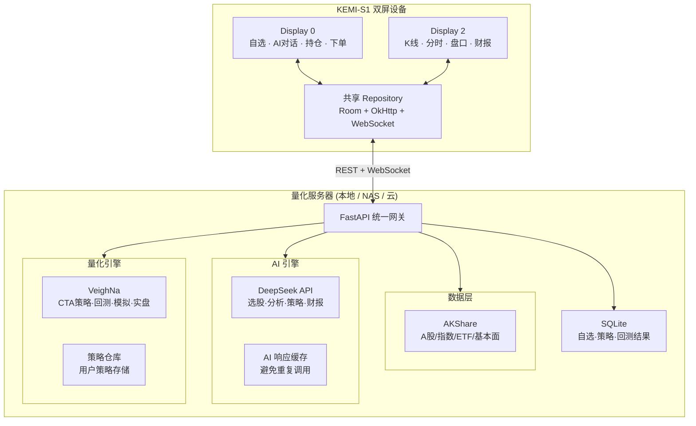

# KEMI-S1 DeepSeek 智能量化交易系统规划

> **一句话**：用户只需填入 DeepSeek API Key，即可在双屏设备上独立运行专业级 A 股量化交易系统——AI 选股、AI 看盘、AI 写策略、AI 解读财报，全部离线数据 + 云端 AI 混合架构。
>
> 基于 [stock-software-selection.md](./stock-software-selection.md) 的选型结论，本文给出完整产品架构、开源组件组合和分阶段实施路线。

---

## 1. 产品定位

### 用户只需要做一件事

```
打开设置 → 粘贴 DeepSeek API Key → 开始使用
```

不用配置数据源、不用搭服务器、不用写代码。

### 核心能力矩阵

| 能力域 | 无 Key 时 | 填入 Key 后 |
| :--- | :--- | :--- |
| 行情查看 | ✅ 实时行情、K 线、分时、盘口 | ✅ 同左 |
| 自选股管理 | ✅ 添加/删除/排序 | ✅ AI 智能推荐自选 |
| 技术指标 | ✅ 内置 30+ 指标 | ✅ AI 解读指标信号 |
| AI 选股 | ❌ | ✅ 自然语言描述条件，AI 筛选 |
| AI 看盘 | ❌ | ✅ AI 分析个股走势、形态、量价 |
| AI 财报 | ❌ | ✅ 上传 PDF / 输入代码，AI 解读 |
| AI 策略 | ❌ | ✅ 自然语言描述 → 自动生成回测代码 |
| 量化回测 | ✅ 手动写策略 | ✅ AI 辅助生成 + 解释回测结果 |
| 模拟交易 | ✅ 手动下单 | ✅ AI 建议买卖点 |
| 真实交易 | 需券商授权 | 需券商授权 + AI 风控建议 |

---

## 2. 总体架构



### 关键设计决策

| 决策 | 选择 | 理由 |
| :--- | :--- | :--- |
| 量化引擎 | VeighNa | CTA 策略引擎、回测、模拟交易、真实券商网关均成熟；MIT 许可 |
| 数据源 | AKShare | 覆盖 A 股全品类，MIT 许可，pip 安装即用 |
| AI 模型 | DeepSeek API | 国产、中文理解强、性价比高、API 兼容 OpenAI 格式 |
| 服务端框架 | FastAPI | 异步高性能、WebSocket 原生支持、Python 生态无缝 |
| 本地存储 | SQLite | 零配置、单文件、足够个人使用 |
| 图表 | Lightweight Charts Android 5.2.0 | Kotlin API 完整、离线运行 |

---

## 3. 开源组件组合

### 3.1 逐层清单

| 层级 | 组件 | 仓库 | 许可证 | 作用 |
| :--- | :--- | :--- | :--- | :--- |
| **图表** | Lightweight Charts Android | `tradingview/lightweight-charts-android` | Apache-2.0 | K 线、分时、成交量、指标叠加 |
| **图表备选** | KLineChart | `klinecharts/KLineChart` | Apache-2.0 | 更多内置指标和画线工具 |
| **行情数据** | AKShare | `akfamily/akshare` | MIT | A 股/指数/ETF/基金/债券/宏观 全品类数据 |
| **量化引擎** | VeighNa | `vnpy/vnpy` | MIT | CTA 策略引擎、回测、模拟交易、券商网关 |
| **AI 服务** | DeepSeek API | `api.deepseek.com` | 商用 API | 选股、分析、策略生成、财报解读 |
| **API 网关** | FastAPI | 标准 Python 包 | MIT | REST + WebSocket 统一服务 |
| **策略回测** | VeighNa CTA Backtester | `vnpy/vnpy_ctabacktester` | MIT | 图形化回测、参数优化 |
| **因子分析** | alphalens | `quantopian/alphalens` | Apache-2.0 | 因子 IC 分析、分层回测、换手率分析 |
| **组合分析** | pyfolio | `quantopian/pyfolio` | Apache-2.0 | 收益曲线、夏普比率、最大回撤、滚动分析 |
| **Android 壳** | 双 Activity 架构 | KEMI-S1 自有 | — | 双屏独立交互 |

### 3.2 组件关系图

```
┌─────────────────────────────────────────────────────────┐
│                    Android 双屏客户端                      │
│  Display 0: 自选/AI对话/持仓/下单                         │
│  Display 2: K线/分时/盘口/财报                             │
│  图表: Lightweight Charts Android 5.2.0                   │
└──────────────────────┬──────────────────────────────────┘
                       │ REST + WebSocket
┌──────────────────────▼──────────────────────────────────┐
│                  FastAPI 统一服务层                        │
│                                                          │
│  /api/v1/quote/{symbol}        行情快照                   │
│  /api/v1/kline/{symbol}        K线历史                    │
│  /api/v1/ai/chat               AI 对话 (DeepSeek)         │
│  /api/v1/ai/screen             AI 选股                    │
│  /api/v1/ai/analysis/{symbol}  AI 个股分析                 │
│  /api/v1/ai/report/{symbol}    AI 财报解读                 │
│  /api/v1/ai/strategy/generate  AI 策略生成                 │
│  /api/v1/strategy/backtest     策略回测                    │
│  /api/v1/trade/order           下单 (模拟/实盘)            │
│  /api/v1/portfolio             持仓查询                    │
│  /ws/quote                     实时行情推送                 │
└──────────────────────┬──────────────────────────────────┘
                       │
        ┌──────────────┼──────────────┐
        ▼              ▼              ▼
   ┌─────────┐  ┌──────────┐  ┌──────────┐
   │ AKShare │  │ DeepSeek │  │ VeighNa  │
   │ 行情数据 │  │ AI 分析   │  │ 量化交易  │
   └─────────┘  └──────────┘  └──────────┘
```

---

## 4. AI 功能详细设计（核心差异化）

### 4.1 AI 选股

用户用自然语言描述条件，DeepSeek 将其转为结构化筛选参数，再通过 AKShare 执行：

```
用户: "找出市盈率低于20、ROE大于15%、市值超过500亿的A股消费股"
  → DeepSeek: 解析条件 → {pe<20, roe>15, market_cap>500亿, sector:消费}
  → AKShare: 执行筛选
  → 返回列表 + DeepSeek 一句话点评每只
```

```python
# 服务端伪代码
async def ai_screen(query: str, deepseek_key: str):
    # Step 1: DeepSeek 将自然语言转为筛选条件
    prompt = f"""将以下选股需求转为 JSON 筛选条件：
    {query}
    返回格式：{{"conditions": [{{"field":"pe","op":"<","value":20}}], "sectors":["消费"]}}
    可用字段：pe, pb, roe, market_cap, revenue_growth, profit_growth, dividend_yield
    """
    conditions = await deepseek_chat(prompt, deepseek_key)

    # Step 2: AKShare 执行筛选
    all_stocks = ak.stock_zh_a_spot_em()
    filtered = apply_conditions(all_stocks, conditions)

    # Step 3: DeepSeek 点评 Top 5
    top5 = filtered.head(5).to_dict()
    commentary = await deepseek_chat(f"点评以下5只股票：{top5}", deepseek_key)

    return {"results": filtered.to_dict(), "ai_commentary": commentary}
```

### 4.2 AI 看盘

选中一只股票后，AI 自动分析技术面：

```
Display 2 显示 K 线图 + Display 0 显示 AI 分析面板

AI 输出示例：
  📊 贵州茅台 (600519) 技术分析
  • 趋势：处于上升通道，股价在 20 日均线上方运行
  • MACD：日线 MACD 金叉形成，DIF 上穿 DEA
  • 成交量：近 5 日成交量温和放大，量价配合良好
  • 支撑/压力：短期支撑 1780，压力 1920
  • 风险提示：RSI 接近超买区 (68)，注意短期回调风险
  ⚠️ 以上为 AI 技术分析，不构成投资建议
```

### 4.3 AI 财报解读

用户输入股票代码或上传 PDF 财报：

```
用户: "解读茅台最新季报"
  → AKShare: 获取财务数据
  → DeepSeek: 生成解读报告
     • 营收：XX 亿，同比 +XX%，主要驱动因素是...
     • 利润：XX 亿，同比 +XX%，毛利率变化原因是...
     • 现金流：经营活动现金流 XX 亿，同比 XX
     • 风险点：应收账款增加 XX%，需要关注...
     • 机构持仓变化：Q2 增持 XX 家，减持 XX 家
```

### 4.4 AI 策略生成（量化核心）

用户用自然语言描述策略 → DeepSeek 生成 VeighNa 策略代码 → 一键回测：

```
用户: "写一个双均线策略，5日均线上穿20日均线买入，下穿卖出，每只股票最多持仓20%"

DeepSeek 生成:
```python
from vnpy_ctastrategy import (
    CtaTemplate, StopOrder, TickData, BarData, TradeData, OrderData
)

class DoubleMaStrategy(CtaTemplate):
    author = "DeepSeek AI"

    fast_window = 5
    slow_window = 20
    max_position_pct = 0.2

    parameters = ["fast_window", "slow_window", "max_position_pct"]

    def __init__(self, cta_engine, strategy_name, vt_symbol, setting):
        super().__init__(cta_engine, strategy_name, vt_symbol, setting)
        self.fast_ma = None
        self.slow_ma = None

    def on_bar(self, bar: BarData):
        # 计算均线
        bars = self.cta_engine.get_bars(self.vt_symbol, self.slow_window + 1)
        closes = [b.close_price for b in bars]
        self.fast_ma = sum(closes[-self.fast_window:]) / self.fast_window
        self.slow_ma = sum(closes) / self.slow_window

        # 金叉买入
        if self.fast_ma > self.slow_ma and self.pos == 0:
            self.buy(bar.close_price, self.max_position_pct)
        # 死叉卖出
        elif self.fast_ma < self.slow_ma and self.pos > 0:
            self.sell(bar.close_price, abs(self.pos))
```

→ 用户点击"回测" → VeighNa CTA Backtester 执行 → 返回收益曲线、夏普比率、最大回撤
→ DeepSeek 解读回测结果："该策略在 2023-2025 年化收益 18.5%，夏普 1.2，最大回撤 15%，在震荡市中表现一般，建议增加趋势过滤..."
```

### 4.5 AI 对话（贯穿全局）

类似 ChatGPT 侧边栏，但针对股票场景优化：

| 对话类型 | 示例 |
| :--- | :--- |
| 行情查询 | "今天涨幅最大的板块是什么" |
| 个股分析 | "分析宁德时代最近一个月的走势" |
| 策略讨论 | "什么是网格交易？适合当前市场吗" |
| 风控建议 | "我的持仓集中在新能源，如何分散风险" |
| 学习问答 | "MACD 金叉和死叉分别代表什么" |

---

## 5. 量化交易能力矩阵

### 5.1 策略类型

| 策略类型 | 内置 | AI 辅助 | 说明 |
| :--- | :---: | :---: | :--- |
| 双均线交叉 | ✅ | ✅ | 经典趋势跟踪 |
| MACD 信号 | ✅ | ✅ | 金叉死叉 |
| 布林带突破 | ✅ | ✅ | 波动率策略 |
| RSI 超买超卖 | ✅ | ✅ | 均值回归 |
| 网格交易 | ✅ | ✅ | 震荡市利器 |
| 海龟交易 | ✅ | ✅ | 趋势突破 |
| 多因子选股 | — | ✅ | AI 辅助构建因子 |
| 配对交易 | — | ✅ | 统计套利 |
| 自定义 | — | ✅ | 自然语言描述 |

### 5.2 回测能力

```
┌────────────────────────────────────────────────┐
│              量化回测工作流                       │
│                                                │
│  ① 选择策略 (内置 / AI生成 / 手写)               │
│       ↓                                        │
│  ② 选择标的 (单只 / 股票池 / 全A)                │
│       ↓                                        │
│  ③ 设置参数 (周期 / 手续费 / 滑点 / 初始资金)     │
│       ↓                                        │
│  ④ 执行回测 (VeighNa CTA Backtester)           │
│       ↓                                        │
│  ⑤ 查看结果                                     │
│     ├─ 收益曲线       (pyfolio)                 │
│     ├─ 夏普/卡玛比率   (pyfolio)                 │
│     ├─ 最大回撤        (pyfolio)                 │
│     ├─ 胜率/盈亏比                                │
│     ├─ 月度收益热力图                             │
│     └─ AI 解读回测报告  (DeepSeek)               │
│       ↓                                        │
│  ⑥ 参数优化 (遗传算法 / 网格搜索)                │
│       ↓                                        │
│  ⑦ 部署到模拟交易 → 观察 N 天 → AI 评估          │
│       ↓                                        │
│  ⑧ 确认后部署到实盘 (需券商授权)                  │
└────────────────────────────────────────────────┘
```

### 5.3 风控体系

| 风控维度 | 实现方式 |
| :--- | :--- |
| 单只最大仓位 | ≤ 20% 总资金 |
| 行业集中度 | ≤ 40% 单行业 |
| 日内回撤熔断 | 回撤 > 5%，暂停交易并 AI 告警 |
| 连续止损熔断 | 连续 3 笔止损，暂停 30 分钟 |
| AI 风控建议 | 每日开盘前 AI 评估持仓风险 |

---

## 6. 双屏产品布局

| 模式 | Display 0（主屏） | Display 2（副屏） |
| :--- | :--- | :--- |
| **看盘模式** | 自选列表 + AI 分析面板 | 全屏 K 线图 + 技术指标 |
| **选股模式** | AI 对话输入条件 | 筛选结果列表 + 每只 K 线缩略图 |
| **财报模式** | AI 财报解读文字 | 财务数据图表（营收/利润/现金流趋势） |
| **回测模式** | 策略代码 + 参数面板 | 回测收益曲线 + 风险指标 |
| **交易模式** | 下单面板 + 持仓列表 | 委托队列 + 成交明细 + 盘口 |
| **学习模式** | AI 对话问答 | 知识点可视化（K 线形态标注等） |

---

## 7. 零配置体验设计

### 用户首次启动流程

```
① 安装 APK → 打开 App
② 看到欢迎页："请填入 DeepSeek API Key 以启用 AI 功能"
   （获取链接：https://platform.deepseek.com/api_keys）
   下方有"跳过，仅使用基础行情"按钮
③ 填入 Key → 点击"验证"
④ 验证成功 → 自动拉取全 A 股列表 → 进入主界面
⑤ Display 0 显示自选股（初始为空，AI 建议添加热门）
   Display 2 显示上证指数 K 线
```

### 服务端一键启动

```bash
# 在本地 Mac / NAS / 云服务器上：
pip install kemiquant-server
kemiquant-server --host 0.0.0.0 --port 8800

# Android App 设置中填入服务器地址即可
# 如果服务器和 App 在同一局域网，自动发现（mDNS）
```

服务器启动后自动：
- 从 AKShare 下载全 A 股列表
- 初始化 SQLite 数据库
- 启动行情定时同步任务
- 等待客户端连接

---

## 8. 开源组件版本锁定

| 组件 | 推荐版本 | 锁定原因 |
| :--- | :--- | :--- |
| Lightweight Charts Android | 5.2.0 | 稳定 Kotlin API，WebMessage 通道成熟 |
| KLineChart | 10.0.0 (等 stable) | v10 beta 已完成 API 定型，等正式版 |
| AKShare | ≥ 1.14.0 | 持续更新中，用 `--upgrade` 保持最新 |
| VeighNa | 4.4.0 | 当前稳定版，Python 3.10-3.13 |
| FastAPI | ≥ 0.110 | 异步支持完善 |
| DeepSeek API | `deepseek-chat` 模型 | 性价比最优的对话模型 |
| SQLite | 3.x (Python 内置) | 零配置 |

---

## 9. 分阶段实施路线

### 阶段 0：服务器 MVP（2-3 周，一个人）

**目标**：FastAPI 服务器跑起来，能返回行情数据和 AI 回复。

```
□ FastAPI 项目骨架 + requirements.txt
□ /api/v1/quote/{symbol} — AKShare 实时行情
□ /api/v1/kline/{symbol} — AKShare 历史 K 线
□ /api/v1/ai/chat — DeepSeek 对话代理（缓存同一问题 1 小时内不重复调用）
□ /api/v1/ai/analysis/{symbol} — AI 个股技术分析
□ /ws/quote — WebSocket 实时推送（5 秒轮询 AKShare → 广播）
□ DeepSeek Key 管理（加密存储 + 用量统计）
□ SQLite 自选股存储
```

### 阶段 1：Android 双屏客户端（3-4 周）

**目标**：双屏行情浏览 + AI 对话。

```
□ 双 Activity 架构（Display 0 + Display 2）
□ 共享 ViewModel 管理选中股票状态
□ Lightweight Charts Android K 线 + 分时
□ Display 0: 自选股列表 + AI 对话面板
□ Display 2: 全屏图表
□ DeepSeek Key 设置页面 + 验证
□ 服务器地址配置（支持局域网自动发现）
□ Room 缓存最近行情和 K 线
```

### 阶段 2：AI 选股 + 财报（2-3 周）

```
□ AI 选股：自然语言 → 条件筛选
□ AI 财报解读：输入代码 → 结构化解读
□ AI 看盘增强：技术形态识别（头肩顶、W 底、三角形等）
□ AI 新闻摘要：聚合同花顺/东方财富新闻 → DeepSeek 总结
□ AI 响应缓存层（避免同一问题重复调用 API）
```

### 阶段 3：量化回测（3-4 周）

```
□ VeighNa CTA Backtester 集成
□ AI 策略生成：自然语言 → Python 策略代码
□ 策略管理：保存/编辑/删除/分享
□ 回测参数面板：周期、手续费、滑点、初始资金
□ 回测结果可视化 (pyfolio)
□ AI 解读回测报告
□ 参数优化（网格搜索 + 遗传算法）
```

### 阶段 4：模拟交易（2-3 周）

```
□ VeighNa Paper Account 集成
□ 模拟下单：限价/市价、止盈止损
□ 模拟持仓管理 + 资金曲线
□ AI 买卖点建议
□ AI 每日复盘报告（自动生成）
```

### 阶段 5：真实交易（评审后，周期不定）

```
□ 券商网关选择（XTP/EMT/CTP，需券商授权）
□ 真实交易风控层（独立于模拟环境）
□ 证书/密钥管理（HSM 或加密存储）
□ 交易审计日志
□ 合规评审（行情授权、交易许可、隐私政策）
```

---

## 10. 成本估算

### 用户侧（每人）

| 项目 | 月成本 | 说明 |
| :--- | :--- | :--- |
| DeepSeek API | ¥10-50 | 日常问答 + 选股 + 分析，约 50-200 次调用/天 |
| 服务器 | ¥0 | 可运行在本地 Mac/NAS/树莓派上 |
| 行情数据 | ¥0 | AKShare 免费（仅限个人使用） |
| **合计** | **¥10-50/月** | |

### DeepSeek 用量优化策略

| 优化 | 节省比例 |
| :--- | :---: |
| 相同问题 1 小时内缓存不重复调用 | ~40% |
| K 线数据仅在用户请求时发送最近 200 根（不送全量） | ~30% |
| 批量选股结果缓存 5 分钟 | ~15% |
| 使用 `deepseek-chat` 而非 `deepseek-reasoner`（日常问答够用） | ~50% |

---

## 11. 风险与缓解

| 风险 | 缓解措施 |
| :--- | :--- |
| AKShare 上游数据源变更 | 抽象 DataProvider 接口，可切换 tushare/mootdx |
| DeepSeek API 涨价或不可用 | 抽象 AIProvider 接口，可切换 OpenAI / 通义千问 / 本地模型 |
| VeighNa 版本 breaking change | 锁定 4.4.0，升级前在 CI 中跑完整回测套件 |
| 策略代码由 AI 生成有 bug | 沙箱执行回测，异常自动捕获并反馈给 AI 修正 |
| 用户过度依赖 AI 建议导致亏损 | 每处 AI 输出均标注"不构成投资建议"，UI 层强制展示风控指标 |
| 真实交易的法律和合规风险 | 阶段 5 独立评审，不与其他阶段混合 |

---

## 12. 与现有选型文档的关系

| 文档 | 本文补充的内容 |
| :--- | :--- |
| [stock-software-selection.md](./stock-software-selection.md) | 基础选型和组合对比 |
| **本文** | 在选型基础上，增加 AI 层设计、零配置体验、量化策略框架、详细的 API 和双屏布局、分阶段实施路线 |

---

## 13. 最终技术栈总览

```
KEMI-S1 DeepSeek 量化交易系统

┌─ Android 客户端 ─────────────────────────────┐
│  Kotlin + Jetpack Compose                     │
│  双 Activity (Display 0 + Display 2)          │
│  Lightweight Charts Android 5.2.0             │
│  Room + OkHttp + WebSocket                    │
└───────────────────────────────────────────────┘
                      │
┌─ 量化服务器 (FastAPI) ────────────────────────┐
│  Python 3.12                                  │
│  ├─ AKShare (行情数据)                         │
│  ├─ DeepSeek API (AI 分析)                     │
│  ├─ VeighNa 4.4.0 (策略 + 回测 + 交易)         │
│  ├─ alphalens (因子分析)                       │
│  ├─ pyfolio (组合分析)                         │
│  └─ SQLite (本地存储)                          │
└───────────────────────────────────────────────┘
```
