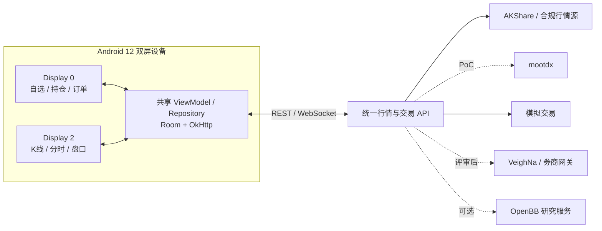

# KEMI-S1 双屏股票软件开源组合选型

> 目标：在 Android 12 双屏设备上建设可持续演进的股票行情、分析和模拟交易应用，而不是把桌面端或 Web 端整套软件强行塞进 APK。

## 1. 结论先行

目前没有一个成熟开源项目能同时满足以下条件：

- 原生支持 Android 12；
- 原生支持 Display 0 / Display 2 双 Activity 独立交互；
- 覆盖中国 A 股行情、技术分析、资产组合和真实交易；
- 可在 RK356x / V900、6GB RAM 的设备上稳定运行；
- 许可证和行情数据允许产品化使用。

因此推荐采用“设备端原生壳 + 嵌入式图表 + 独立行情服务 + 可选交易服务”的组合，而不是移植 Ghostfolio、OpenBB 或 VeighNa 的完整桌面/Web UI。

### 主推荐组合

| 层级 | 推荐组件 | 用途 |
| :--- | :--- | :--- |
| Android 壳 | Kotlin + 双 Activity | Display 0 显示自选、行情和交易控制；Display 2 显示大图、盘口和资讯 |
| 图表 | `tradingview/lightweight-charts-android` 5.2.0 | 使用现成 Kotlin API 和离线 WebView 资源快速完成首版 K 线、分时和成交量 |
| 网络 | OkHttp REST + WebSocket | 统一连接行情、组合和模拟交易服务 |
| 本地数据 | Room | 缓存自选股、最近行情、K 线和用户布局，不保存券商明文凭证 |
| 首版行情后端 | 自建轻量 API + AKShare | 用于只读行情、历史数据和基本面验证 |
| A 股行情备选 | mootdx | 通过局域网/服务器读取通达信协议数据，仅用于 PoC 和非商业验证 |
| 模拟/真实交易后端 | VeighNa + WebTrader/RPC | 提供 REST 请求、WebSocket 推送、模拟撮合和后续券商网关接入 |
| 扩展研究后端 | OpenBB Platform | 仅在需要跨市场研究和标准化数据接口时引入 |

首版边界应锁定为：**只读行情 + 自选股 + 双屏联动 + 模拟交易**。真实下单必须在券商授权、行情授权、安全和合规评审完成后单独立项。

## 2. 为什么这套组合适合 KEMI-S1

设备基线来自 [chip.md](./chip.md) 和 [reseach.md](./reseach.md)：Android 12/API 31、双 1920×1280 屏、Mali-G52、6GB RAM，推荐单应用组合 RAM 不超过 500MB。

### 设备端职责

- 使用 [chip.md](./chip.md) 的双 Activity 模式把两个屏幕作为同一业务会话管理。
- Display 0 使用原生 RecyclerView/Compose 列表显示自选、涨跌、持仓和订单，避免两个屏幕都运行重型 Web 页面。
- Display 2 只在需要时承载一个图表 WebView，其余盘口、资讯和快捷操作仍使用原生控件。
- 使用 [cross-display-keyboard.md](./cross-display-keyboard.md) 的会话模型处理搜索、价格和数量输入。
- 复用 [dscr.md](./dscr.md) 的系统能力做双屏演示录制，但录屏能力不得进入下单关键路径。

### 服务端职责

- 聚合不同来源的数据，统一证券代码、交易所、时区、复权方式、价格精度和成交量单位。
- 保存行情源和券商连接凭证；Android 端只持有短期访问令牌或设备证书。
- 处理限流、断线重连、数据去重、K 线合成、交易风控和审计日志。
- 向设备提供稳定的 REST 快照和 WebSocket 增量协议，避免 APK 直接依赖易变的网页接口。

## 3. 候选项目对比

### 3.1 图表层

| 项目 | 许可证与现状 | 优点 | 风险 | 结论 |
| :--- | :--- | :--- | :--- | :--- |
| [TradingView Lightweight Charts Android](https://github.com/tradingview/lightweight-charts-android) | Apache-2.0；当前 README 示例版本为 5.2.0；minSdk 23；要求 WebView/Chrome provider 支持 ES2020 | Kotlin API 完整，AndroidX WebKit WebMessage 通道，JS 打包在 APK 内，可离线运行，接入成本最低 | 必须按 NOTICE 做 TradingView 署名并提供链接；内置指标和画线能力不如专业交易图表；依赖系统 WebView 特性 | **首版主选** |
| [KLineChart](https://github.com/klinecharts/KLineChart) | Apache-2.0；当前主线为 10.0.0-beta3，v10 与 v9 API 不兼容 | 面向 K 线场景，内置多种技术指标和画线/覆盖物，Canvas 渲染，移动端支持好，零运行时依赖 | 没有官方 Android Kotlin 封装；需要自建 WebView bridge；当前 v10 仍为 beta；需验证 Android WebView 91 的 `Intl`、Canvas 和触摸行为 | **专业图表 PoC/第二阶段候选** |
| [KChartView](https://github.com/tifezh/KChartView) | Apache-2.0；原生 Android Canvas 项目 | 不依赖 WebView，指标和手势实现可作为原生方案参考 | 项目使用较旧的 Android Support Library 和构建体系，现代化、无障碍和长期维护成本高 | **无 WebView 备用，不作为默认主线** |

#### WebView 版本策略

- 首版固定 `com.tradingview:lightweightcharts:5.2.0`，禁止运行时从 CDN 拉取脚本。
- 保存 Maven 依赖版本、JS 资源版本和 SHA-256，升级时单独做图表回归。
- 启动时检查 `CREATE_WEB_MESSAGE_CHANNEL`、`POST_WEB_MESSAGE`、`WEB_MESSAGE_PORT_SET_MESSAGE_CALLBACK` 和 `WEB_MESSAGE_PORT_POST_MESSAGE`。
- 在目标固件的实际 Android System WebView provider 上验证，不能只以 Android API 31 推断兼容。
- 若首版必须提供大量指标、画线和自定义覆盖物，先并行验证 KLineChart；v10 稳定前应锁定经过测试的具体提交或稳定版，不跟随 `main`。

### 3.2 行情与研究后端

| 项目 | 许可证与运行环境 | 可用能力 | 主要风险 | 适用位置 |
| :--- | :--- | :--- | :--- | :--- |
| [AKShare](https://github.com/akfamily/akshare) | MIT；Python 3.9+ 64 位 | A 股、指数、ETF、基金、历史/实时行情、基本面、资金流等大量中国市场接口 | 很多接口抓取公共网站，字段和接口会随上游变化；代码许可证不等于上游数据可商用 | **服务器侧首版数据验证** |
| [mootdx](https://github.com/mootdx/mootdx) | LICENSE 为 MIT；Python 3.8+ | 通达信 A 股/指数/ETF 行情、分钟线、日线、逐笔和 F10，支持本地文件和在线协议 | README 同时声明“不得用于任何商业目的”，需法务确认；扩展市场接口已失效；场内基金和可转债存在价格倍率待办 | **局域网 PoC 备选** |
| [OpenBB](https://github.com/OpenBB-finance/OpenBB) | AGPL-3.0；Python 服务栈 | 标准化多数据源、FastAPI、跨市场研究和扩展机制 | 体量大，AGPL 网络服务义务需评估；开源仓库提供数据平台，OpenBB Workspace 是企业 UI；中国 A 股不是核心优势 | **可选研究服务，不进 APK** |

AKShare 和 mootdx 都不应直接打进 Android APK。它们依赖 Python、pandas、网页接口或专用协议，在 ARM Android 上维护困难，也会放大包体、冷启动和故障面。

### 3.3 组合、交易与完整应用

| 项目 | 许可证与技术栈 | 值得复用的部分 | 不适合直接移植的原因 | 结论 |
| :--- | :--- | :--- | :--- | :--- |
| [VeighNa](https://github.com/vnpy/vnpy) | MIT；4.4.0；Python 3.10-3.13；桌面 UI 为 PySide6 | 事件引擎、模拟交易、风控、RPC、WebTrader REST/WebSocket，以及 XTP/EMT 等 A 股网关生态 | Android 不受支持；大量网关依赖 Windows/Ubuntu 和券商 C/C++ API；各网关还需单独核对许可证与开户授权 | **模拟/真实交易服务器首选** |
| [Ghostfolio](https://github.com/ghostfolio/ghostfolio) | AGPL-3.0；Angular/NestJS/PWA 服务 | 资产组合、收益分析、持仓和隐私产品设计可作参考 | 是自托管财富管理 Web 应用，不是 Android 行情/下单终端；服务和数据库较重；A 股及券商接入不是核心 | **只参考产品模型** |
| OpenBB Workspace | 企业 Web UI，不是本仓库中的完整开源客户端 | 研究工作台交互和数据可视化思路 | 不能作为可自由移植的 Android 开源 UI，且双屏和离线能力不匹配 | **不纳入移植范围** |

## 4. 推荐实施路线

### 阶段 0：两周硬件 PoC

只验证最容易推翻方案的风险：

1. 创建 Display 0 / Display 2 双 Activity，共享同一证券选择状态。
2. Display 0 显示 20 个自选股的原生列表，Display 2 显示 5,000 根离线 K 线。
3. 集成 Lightweight Charts Android 5.2.0，验证 WebMessage 通道、触摸缩放、横竖屏/键盘 resize 和 Activity 重建。
4. 使用录制数据模拟每秒 5-10 次行情更新，不连接真实券商。
5. 测量 PSS、掉帧、WebView 崩溃恢复和 4 小时稳定性。

PoC 不通过时的切换条件：

- WebMessage 特性缺失或 WebView 无法随固件升级：切换 KChartView 原生方案评估。
- Lightweight Charts 指标/画线缺口成为产品阻塞：切换 KLineChart WebView PoC。
- 双屏同时高频更新掉帧：副屏降频到 5-10Hz，K 线只增量更新，列表使用 DiffUtil 合并刷新。

### 阶段 1：只读行情 MVP

- 实现统一 `QuoteRepository`，区分 REST 快照和 WebSocket 增量。
- 服务端先以 AKShare 验证 A 股、指数、ETF、日线和基本面接口。
- Room 缓存最近 K 线、自选股和显示布局，离线时明确显示最后更新时间。
- 增加断线重连、心跳、序列号去重和全量重同步。
- 统一证券标识，例如 `XSHG:600000`、`XSHE:000001`，禁止只传六位代码。

### 阶段 2：模拟交易

- 接入 VeighNa `paper_account` 或自建确定性撮合服务。
- Android 只调用订单门面 API，不直接依赖 VeighNa Python 对象。
- 增加委托确认、撤单、成交、持仓、资金、交易日和涨跌停规则。
- 所有订单使用客户端请求 ID 保证幂等，并记录服务端审计日志。

### 阶段 3：真实交易评审

真实交易不得通过“换一个接口地址”从模拟模式直接开启。上线前至少完成：

- 券商 API、账户类型、设备形态和地域的书面授权；
- 实时/延时行情展示、缓存和再分发许可；
- 服务端密钥管理、TLS/双向认证、令牌轮换和设备吊销；
- 价格、数量、频率、撤单率、资金和持仓风控；
- 交易确认、故障降级、对账、审计、日志留存和应急停机；
- 网络断开、重复请求、乱序推送、部分成交和交易日切换测试；
- 适用的监管、隐私、网络安全和软件许可证审查。

## 5. 双屏产品布局建议

| 状态 | Display 0 | Display 2 |
| :--- | :--- | :--- |
| 浏览行情 | 自选股、市场概览、搜索 | 选中证券的分时/K线、盘口、成交明细 |
| 技术分析 | 周期、复权、指标和画线控制 | 全屏图表，隐藏非必要导航 |
| 模拟交易 | 价格、数量、买卖、撤单、风控提示 | 持仓盈亏、委托队列、成交回报 |
| 研究模式 | 基本面摘要、事件列表 | 图表与事件标记、财报或资讯正文 |
| 断网/服务故障 | 明确显示连接状态并禁用下单 | 保留缓存图表和最后更新时间 |

两个 Activity 应共享仓库层状态，但不要互相直接持有 View 或 Activity 引用。副屏关闭、重建或 Display 2 暂时消失时，行情订阅必须按可见页面重新计数，防止重复订阅和内存泄漏。

## 6. 验收门槛

### 性能

- 应用 PSS 峰值不超过 500MB，稳定浏览目标不超过 300MB。
- 双屏静态页面保持 60fps；行情增量期间无连续明显掉帧。
- 单图加载 20,000 根日线不崩溃，默认只渲染可见窗口。
- 高频 tick 合并后刷新 UI，禁止每个网络包触发整页重组。

### 稳定性

- 连续运行 4 小时，主副屏切换证券、周期和前后台后无持续内存增长。
- WebView renderer 被系统回收后可恢复图表和当前证券。
- 网络断开、服务重启和 WebSocket 重连后不重复 K 线、不重复订单。
- Display 2 热插拔或 Activity 重建后不会创建第二套交易会话。

### 安全与业务

- APK、日志、Room 数据库和崩溃报告中无券商密码、行情密钥或长期令牌。
- 行情时间、交易所、复权和延迟状态在 UI 中可追溯。
- 模拟和真实环境使用不同域名、证书、账户和明显的视觉标识。
- 所有第三方 NOTICE、署名、源码提供义务和数据授权已形成清单。

## 7. 不推荐方案

- **直接把 VeighNa/PySide6 移植到 Android**：系统、ABI、券商原生库和 UI 模型均不匹配。
- **直接把 Ghostfolio 整站装进 WebView**：双屏交互、A 股行情和交易能力仍需重写，还引入完整 Web 服务依赖。
- **把 AKShare/mootdx 嵌入 APK**：Python 数据栈和易变上游接口不应成为设备端核心依赖。
- **首版同时接真实交易**：会把 UI、行情、风控、凭证和合规风险混在一次验证中，无法定位问题。
- **运行时使用 CDN 图表脚本**：会造成离线失败、版本漂移、供应链和兼容性不可控。
- **两个屏幕各自建立行情和交易连接**：容易重复订阅、重复下单和状态分叉；连接必须由共享仓库层统一管理。

## 8. 最终建议

首版采用：

> **Kotlin 双 Activity + Lightweight Charts Android 5.2.0 + Room + OkHttp + 自建统一 API + AKShare 只读数据**

模拟交易阶段增加：

> **VeighNa paper_account + WebTrader/RPC**

只有当技术指标和画线被证明是首版核心需求时，才把图表主线切换为 KLineChart；只有当目标固件无法稳定支持 WebView/WebMessage 时，才投入 KChartView 的原生现代化改造。这样可以先验证 KEMI-S1 最有价值的双屏行情体验，再逐步增加交易复杂度，同时把 Android、数据源和券商接口保持为可替换边界。