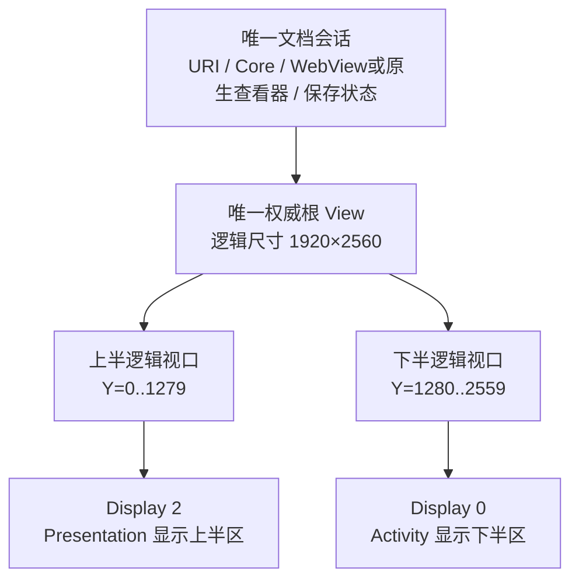
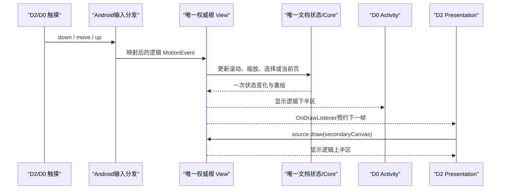

# KEMI OFFICE 双屏画面合成与联动操作实现细节

更新日期：2026-08-09  
当前基线：`v1.0.16 / versionCode 10016`  
目标真机：`192.168.3.62`，Display 2（D2）与 Display 0（D0）均为
`1920×1280@60Hz`

## 1. 文档目的

本文只描述当前代码已经实现并在真机运行的双屏链路，回答以下问题：

1. 两个独立 Android Display 如何组合为一张连续的 `1920×2560` 逻辑画布。
2. 为什么只打开一份文档、只运行一个 Core，却能让 D2 与 D0 显示不同区域。
3. D2、D0 的画面、加载层和状态信息如何叠加。
4. 在任意屏点击、滑动时，为什么另一个屏会跟随同一文档状态变化。
5. 冷启动、屏幕热插拔、方向、键盘和单屏兼容怎样处理。
6. 当前软件 Canvas 镜像的边界，以及以后替换共享 GPU 合成器时必须保持的契约。

本文是当前实现说明；更长期的架构目标见
[单屏兼容与双屏连续画布架构设计](DUAL_DISPLAY_CONTINUOUS_OFFICE_DESIGN.md)。

## 2. 最重要的原则：一个会话、一个状态、两个视口

当前实现不是下面几种方案：

- 不是在两个屏各打开一个 Activity。
- 不是运行两份 LibreOffice Core。
- 不是让两个 WebView 分别滚动后再互相同步位置。
- 不是通过网络或文件在两屏之间传递文档状态。
- 不是持续截取 D0 的物理屏幕再投送到 D2。

真正的结构是：



所有滚动位置、缩放、页码、选择、光标、编辑状态和保存状态都只存在一份。D2 与 D0 只是
同一棵 View 树的两个物理观察窗口。

这保证了联动操作不依赖“双向状态同步”。输入最终都作用于同一个权威 View，状态只修改
一次，两个屏在下一帧分别重新显示自己的区域。

## 3. 启动与显示拓扑门禁

### 3.1 为什么文档 Activity 必须位于 D0

Android `Presentation` 由宿主 Activity 管理。目标硬件要求 D2 是阅读顺序第一屏、D0 是
第二屏，但权威 Activity 必须稳定留在默认 Display 0，才能可靠创建 Display 2 的
Presentation。

[`OfficeLaunchRouter`](../../upstream/android/app/src/main/java/org/libreoffice/androidapp/ui/OfficeLaunchRouter.java)
在满足目标双屏拓扑时，通过 `ActivityOptions.setLaunchDisplayId(Display.DEFAULT_DISPLAY)`
强制把以下查看器放到 D0：

- `LOActivity`：Word、PPT、Excel 等 Core 路径。
- `PdfViewerActivity`。
- `TextDocumentActivity`。
- `CsvDocumentActivity`。
- `StructuredDocumentActivity`。
- `WebDocumentActivity`。

### 3.2 双屏启用条件

[`OfficeDisplayCoordinator`](../../upstream/android/lib/src/main/java/org/libreoffice/androidlib/OfficeDisplayCoordinator.java)
只接受以下显示：

- `Display.STATE_ON`。
- 不是默认 Display。
- 属于 `DISPLAY_CATEGORY_PRESENTATION`。
- 真实分辨率严格为 `1920×1280`。
- 优先使用 `displayId=2`；不存在时才使用第一个合格候选。
- Intent 没有显式携带 `EXTRA_DISABLE_DUAL_DISPLAY`。

门禁不满足时直接进入 `SINGLE`，不创建 Presentation、不扩展根 View，也不锁定双屏方向。

## 4. 两屏如何拼成一张连续画布

### 4.1 逻辑坐标定义

```text
逻辑画布宽度  W = 1920
单屏高度      H = 1280
双屏画布高度  2H = 2560

D2 viewport = Rect(0, 0,    1920, 1280)
D0 viewport = Rect(0, 1280, 1920, 2560)
```

物理阅读顺序固定为：

```text
┌──────────────────────────────┐
│ D2：逻辑 Y = 0..1279         │  第一屏
├──────────物理接缝────────────┤
│ D0：逻辑 Y = 1280..2559      │  第二屏
└──────────────────────────────┘
```

### 4.2 D0 如何显示逻辑下半区

协调器进入 `DUAL_PREPARING` 后，对权威根 View 执行：

```java
params.width = MATCH_PARENT;
params.height = 1280 * 2;
primaryContent.setTranslationY(-1280);
```

根 View 实际布局为 `1920×2560`。它位于 D0 的 Activity 窗口中，但整体向上平移 1280px，
因此 D0 物理窗口看到的是根 View 的逻辑下半区 `Y=1280..2559`。

### 4.3 D2 如何显示逻辑上半区

协调器在 D2 创建一个 Android `Presentation`。Presentation 中不再打开文档，而是放入
`SecondaryContentSurface`。

每次副屏绘制时，它执行：

```java
source.draw(secondaryCanvas);
```

这里的 `source` 就是 D0 Activity 持有的同一个 `1920×2560` 权威根 View。D2 Canvas
本身只有 `1920×1280`，没有额外 Y 平移，所以天然裁取逻辑上半区 `Y=0..1279`。

最终关系是：

| 物理屏 | Window 所属 | 绘制方式 | 看到的逻辑区域 |
|---|---|---|---|
| D2 | `Presentation` | `source.draw(canvas)`，不平移 | `Y=0..1279` |
| D0 | 主 `Activity` | 根 View `translationY=-1280` | `Y=1280..2559` |

页面、图片或表格跨越 `Y=1280` 接缝时，它仍然只是同一棵 View 树中的同一个对象，不需要
复制页面或拼接两个位图。

## 5. 画面和信息层如何叠加

### 5.1 同一 View 树决定 Z 顺序

当前权威根 View 内包含文档内容、工具栏、预览层、状态层和加载层。Android 按正常子 View
顺序合成一次：

```text
权威根 View（1920×2560）
  ├─ 文档内容层：WebView / RecyclerView / 页面流
  ├─ 工具与控制层：返回、菜单、缩略图、页码等
  ├─ 格式专用预览层：例如双屏 PPT 的高清原生页面流
  └─ DualDisplayLoadingOverlay：最上层加载反馈
```

D0 直接显示这棵树的下半区；D2 调用 `source.draw()` 时，以上所有普通 Android View
会按同样的 Z 顺序绘制到副屏 Canvas。因此“信息叠加”不是分别在两个屏维护一套控件，
而是先在统一逻辑画布完成一次层级组合，再由两个视口显示不同区域。

### 5.2 双屏加载卡片的位置

[`DualDisplayLoadingOverlay`](../../upstream/android/lib/src/main/java/org/libreoffice/androidlib/DualDisplayLoadingOverlay.java)
本身覆盖完整 `1920×2560` 根画布，并持有两个卡片：

```text
第一张卡片中心：Y = 2560 × 1/4 = 640   → D2 屏幕中心
第二张卡片中心：Y = 2560 × 3/4 = 1920  → D0 屏幕中心
```

加载底色使用完全不透明的 `0xFFF3F5F8`，防止尚未产出内容的 WebView 从下面透出白屏。
圆弧由 `ClockSpinner` 根据 `SystemClock.uptimeMillis()` 直接在 Canvas 绘制。这样 D0 与 D2
采样同一个时间相位，不依赖系统 `ProgressBar` 的 Drawable 动画能否跨 Presentation 复制。

Office Core 的确定性慢启动调用 `beginImmediately()`；PDF、文本等可能很快完成的查看器调用
延迟 1000ms 的 `begin()`。相同加载操作再次收到 progress start 时，只更新已有卡片，不能
隐藏、重建或重置计时。

### 5.3 PPT 的特殊情况

Chromium/WebView 的 GPU Surface 不能通过 `View.draw(Canvas)` 保持与 D0 相同的清晰度。
因此当前双屏 PPT 默认保留 1920px 原生清晰页面流，Core 在后台热解码；只有用户明确进入
编辑、播放或菜单时才切换 Core 编辑界面。

这是一条格式专用清晰度路径，不改变“一份文档状态、两个视口”的所有权原则。它也说明
当前实现并不是最终共享 GPU Tile Compositor，后续架构替换时不能误删 PPT 的清晰度保护。

## 6. 副屏帧如何跟随主屏更新

### 6.1 正常重绘通知

`SecondaryContentSurface` 给权威根 View 注册 `ViewTreeObserver.OnDrawListener`。主 View
发生滚动、布局、选择或内容更新时，监听器调用 `requestCoalescedFrame()`，在下一次
VSync 使用 `postInvalidateOnAnimation()` 重绘 D2。

`frameScheduled` 保证同一个 VSync 周期内无论收到多少次局部 invalidate，都只合并为一次
副屏绘制，避免滚动时重复提交相同画面。

### 6.2 防止递归重绘

D2 执行 `source.draw(canvas)` 时会经过主 View 的绘制监听器。若不加保护，副屏绘制可能再次
请求副屏绘制并形成循环。

当前使用 `drawingSource` 标志：

```text
D2 开始 source.draw → drawingSource=true
主 View OnDrawListener 被触发 → 发现 drawingSource=true，不重复排帧
D2 完成绘制 → drawingSource=false
```

### 6.3 冷启动保护窗口

真机曾出现日志已经显示加载层，但 D2 仍停留在灰白底。根因是 D2 第一次 `onDraw()` 时，
主根 View 还没有从 1280px 完成到 2560px；旧代码直接 return，副屏帧循环就永久终止。

当前规则：

- `SecondaryContentSurface` 创建后的 1500ms 内持续按 VSync 请求帧。
- 即使 `source.width==0` 或 `source.height<2560`，也必须先预约下一帧再 return。
- 1500ms 后，加载层仍可见时继续按帧采样，确保圆弧动画持续。
- 加载结束后停止主动循环，只由主 View 的真实重绘驱动副屏，避免稳态空耗。
- 加载层显示和退出时主动 invalidate Activity 根 View，加快状态向 D2 传播。

此规则在 62 真机修复验证中达到 5/5 冷启动通过，最终 v1.0.16 正式 APK 又完成 3/3 抽验。

## 7. 两屏触摸如何联动同一个文档

### 7.1 D2 输入路径

D2 的触摸先进入 `SecondaryContentSurface.onTouchEvent()`：

```java
MotionEvent logicalEvent = MotionEvent.obtain(event);
source.dispatchTouchEvent(logicalEvent);
```

D2 是逻辑第一视口，因此 Presentation 给出的 `(x, y)` 直接对应逻辑 `(x, y)`，不增加
1280。目标真机的 D2 物理安装为 180°，但 Android Presentation 已完成方向归一化；应用
再次反转会造成双重旋转，所以当前不做额外旋转矩阵。

### 7.2 D0 输入路径

D0 是真实 Activity，触摸按照 Android 正常 View 分发进入权威根 View。因为根 View 已设置
`translationY=-1280`，Android 父子坐标变换会把 D0 物理 `y` 自然映射到根 View 的逻辑
`y+1280`。

因此两屏映射为：

```text
D2：logicalX = physicalX
    logicalY = physicalY

D0：logicalX = physicalX
    logicalY = physicalY + 1280   // 由 View translation 的反变换完成
```

### 7.3 联动发生的完整链路



所以用户在 D2 滑动后，D0 不是“收到一个同步滚动命令”，而是同一个根 View 的滚动位置已经
改变；D0 和 D2 下一帧自然看到新的上下区域。返回、菜单、缩略图选择和页码变化同理。

## 8. 专用查看器如何接入

Word/PPT/Excel 的 `LOActivity` 在 `setContentView()` 后，把 Activity Content 的第一个
根 View 交给协调器。

PDF、TXT/MD、CSV、JSON/XML、HTML/EPUB/SVG 等专用查看器通过
[`NativeViewerDualDisplay`](../../upstream/android/app/src/main/java/org/libreoffice/androidapp/ui/NativeViewerDualDisplay.java)
统一接入：

1. `attach(activity)` 获取整个文档根 View。
2. 创建一个 `OfficeDisplayCoordinator`。
3. 将根 View 扩展并绑定到 D0/D2 两端。
4. `beginLoading()` 创建统一加载层。
5. 首个有效 viewport 完成时调用 `contentReady()`。
6. Activity 销毁时释放加载层、Presentation、DisplayListener 和 ViewTreeObserver。

必须传整个根 View，不能只传 RecyclerView 或 WebView，否则返回栏、设置、缩略图、加载层
等信息会只存在一屏，无法形成统一 Z 顺序。

## 9. 跨屏键盘联动

文档编辑状态仍属于唯一 `LOActivity`。JavaScript 发出 `KOFFICE_IME_OPEN` 后，Activity
调用 `KOfficeImeProxyActivity.launchForEditor()`；
[`KOfficeDualScreenHelper`](../../upstream/android/lib/src/main/java/org/libreoffice/androidlib/KOfficeDualScreenHelper.java)
根据当前编辑器 Display 选择对侧屏：

- 编辑器在 D0：优先把键盘代理放到 D2。
- 编辑器在非 0 Display：键盘代理放到 D0。
- 没有可用对侧屏：保持当前屏并走标准 Android IME 降级路径。

键盘代理只负责获得系统 IME 和转发文本，不移动文档 Activity、不创建第二个编辑会话。
`KOFFICE_IME_CLOSE` 使用同一 session id 关闭代理，避免旧键盘回调写入新文档。

## 10. 生命周期和异常降级

协调器的状态机为：

```text
SINGLE → DUAL_PREPARING → DUAL_CONTINUOUS
                     ↘ 创建失败 → SINGLE
DUAL_CONTINUOUS → 副屏移除 → SINGLE_FALLBACK → SINGLE
```

- `DisplayListener` 统一处理显示增加、移除和变化。
- `displayGeneration` 每次拓扑协调递增，旧异步结果不能重新接管当前副屏。
- 双屏进入时动态锁定 `SCREEN_ORIENTATION_LANDSCAPE`。
- 副屏消失、Presentation 创建失败或 Activity 销毁时，恢复进入前方向。
- 降级单屏时根 View 恢复 `MATCH_PARENT` 和 `translationY=0`。
- Presentation 销毁不关闭文档，不重建 Core，不丢失当前滚动与编辑状态。
- `WeakReference<View>` 和生命周期 observer 防止副屏 Surface 长期持有已销毁 Activity。

## 11. 当前实现边界

当前 D2 通过软件 `source.draw(Canvas)` 采样普通 Android View，已经适合 PDF、原生列表、
加载层和大部分 Office UI，但存在明确边界：

1. Chromium GPU Surface、视频 Surface、某些硬件纹理不能保证以同等清晰度进入软件 Canvas。
2. D0 与 D2 没有真正的同 generation GPU 提交栅栏，极端情况下可能相差一个 VSync。
3. 当前触摸路由适合每块屏内的完整手势；手指物理跨越屏幕接缝时，Android 不会提供同一个
   连续 pointer，需要上层滚动物理模型保持速度。
4. `1920×1280` 与 D2-first 是目标硬件标定结果，不能未经门禁用于普通外接显示器。

后续共享 GPU Tile Compositor 可以替换“D2 软件采样”这一渲染实现，但必须保持以下契约：

- 一个文档会话和一个权威状态。
- 固定的 D2 上半区、D0 下半区逻辑坐标。
- 任一屏输入进入同一文档状态机。
- 两端显示同一 generation，不能各自滚动或解码。
- 单屏设备不创建副端点，且性能不能退化。

## 12. 排障检查表

| 现象 | 首查位置 | 正确证据 |
|---|---|---|
| 只显示一屏 | 显示门禁、Activity 宿主 | `mode=DUAL_CONTINUOUS primary=0 secondary=2` |
| D2/D0 顺序反了 | `translationY`、D2 Canvas 平移 | D2 不平移；D0 为 `-1280` |
| D2 滑动不联动 | `onTouchEvent` 是否回送 source | `secondary touch physical=... logical=...` |
| D2 画面不更新 | OnDrawListener、`frameScheduled` | 主 View 重绘后 D2 下一 VSync 更新 |
| 冷启动灰白 | 根 View 高度不足后是否继续排帧 | `<2560` 时仍调用 `requestCoalescedFrame()` |
| 卡片出现但圆圈不动 | 是否误用系统 ProgressBar | 使用 Canvas `ClockSpinner` |
| 两屏加载卡片位置错误 | Overlay 是否为 2560px | `dual=true`；卡片中心 Y=640/1920 |
| PPT D2 发糊 | WebView GPU Surface 软件采样 | 保持 1920px 原生清晰页面流 |
| 单屏被锁横屏 | 方向恢复链路 | 无副屏时 `SINGLE` 并恢复原 requestedOrientation |
| 键盘盖住编辑屏 | 跨屏代理目标选择 | D0 请求优先发往 D2，反向发往 D0 |

## 13. 当前验收基线

- 最终 APK：`bin/koffice-v1.0.16-release-arm64-v8a.apk`。
- 62 真机 Word 冷启动修复验证：5/5 次在点击后 0.8 秒显示 D2 加载卡片。
- 同一 `bin` 正式 APK 交付抽验：3/3 次通过。
- 16MB Word 首个清晰正文与图片帧：`+5209ms`。
- 无 FATAL、ANR 或 native fatal signal。
- 证据目录：`artifacts/20260809/koffice-v1016-word-final/`。

